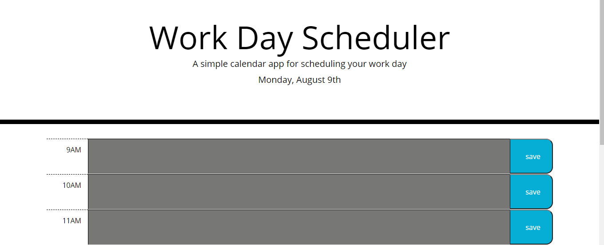
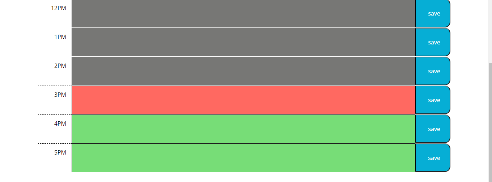

# work-day-scheduler
Deployment: https://eksem95.github.io/work-day-scheduler/

This application is a work day scheduler. It features the current date displayed at the top of the page and regular work hours. Each hour has a text input area for to do items or appointments that will be saved into local storage for later use upon hitting the save button.
 
 